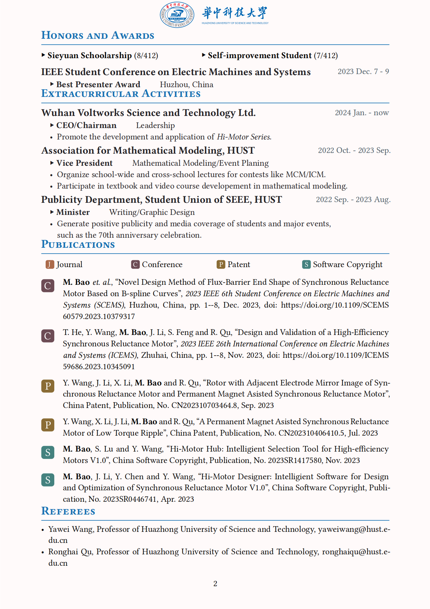

# Typst Template for Academic CV

## What is Typst
Typst is a new markup-based typesetting system that is designed to be as powerful as LaTeX while being much easier to learn and use.

- [Typst Github](https://github.com/typst/typst)
- [Typst Homepage](https://typst.app)

## Preview
preview in [docs.google.com](https://docs.google.com/viewer?url=https://github.com/DawnEver/typst-academic-cv/raw/main/main.pdf&embedded=true)

<!-- 
 -->

<embed src="main.pdf" type="application/pdf" width="100%" height="600px" />

<canvas id="pdf-canvas" style="border: 1px solid;"></canvas>

## Structure
- ./img/  # default image folder
- ./main.typ  # main body of the thesis
- ./template.typ  # template file
- ./[main.pdf](main.pdf) # default output pdf

## Usage
Run `typst compile main.typ` to obtain main.pdf

## Version
Typst>=0.9.0 is recommanded.

## Contribute
Welcome to PRs.